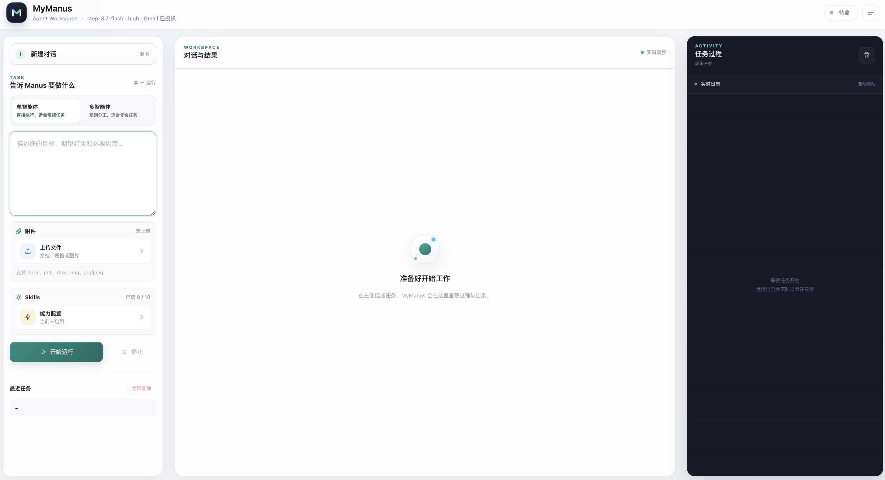

# MyManus

MyManus is a web-first Agent system based on OpenManus. It supports both single-agent ReAct execution and coordinator-led multi-agent execution, replaces the old browser stack with Microsoft Playwright MCP, and adds evidence-aware completion gates, Agent Memory RAG, lightweight Skill matching, and a practical web workspace for tasks, history, attachments, and downloadable Word/Excel deliverables.

<p align="center">
  
</p>

## Features

- Switchable single-agent ReAct and multi-agent execution for every task.
- Multi-agent coordinator with dependency-aware planning, isolated Browser/Data Analysis/General executors, shared results, and final synthesis.
- Web UI at `http://127.0.0.1:7788`.
- Microsoft Playwright MCP browser control with extension mode and vision tools.
- StepFun / StepSearch MCP integration for web search and page fetching.
- Gmail MCP integration for mailbox search, reading, drafting, sending, labels, filters, and attachments.
- Task-level capability routing, evidence receipts, recovery directives, and a Termination Gate that blocks unsupported completion or premature “not found” answers.
- Agent Memory RAG backed by BGE dense embeddings, persistent cross-session history, and retrieval-quality filtering.
- Word `.docx` and Excel `.xlsx` generation tools.
- Upload support for `docx`, `pdf`, `xlsx`, `png`, `jpg`, and `jpeg`.
- Ten reusable Skills loaded from `workspace/skills/*/SKILL.md`, with manual selection and lightweight deterministic matching instead of embedding retrieval.
- Recent task history, continuation context, stop button, and downloadable artifacts.

## 演示

### 洛谷全自动刷题任务

https://github.com/user-attachments/assets/f3bbc40f-6ffc-4541-9843-c35c8fbf1fab

### 自动与豆包对话并总结成Word任务

https://github.com/user-attachments/assets/00a5a116-03b0-414b-8ef9-e9753ceb47e0

备用播放页：[打开全部演示](https://jason2003zzz-ai.github.io/MyManus/demos/)

## Requirements

- Python 3.12+
- Node.js 18+
- Google Chrome
- A StepFun API key
- Optional but recommended: Playwright MCP Bridge / extension token for controlling your logged-in Chrome session
- Optional: a Google Cloud OAuth client for Gmail MCP

## Quick Start

```bash
git clone https://github.com/jason2003zzz-ai/MyManus.git
cd MyManus

python3.12 -m venv .venv
source .venv/bin/activate
python -m pip install -r requirements.txt
python -m pip install -e .

npm install
cp config/config.example.toml config/config.toml
cp config/mcp.example.json config/mcp.json
```

Edit `config/config.toml`:

```toml
[llm]
model = "step-3.7-flash"
base_url = "https://api.stepfun.com/step_plan/v1"
api_key = "YOUR_STEPFUN_API_KEY"
max_tokens = 65536
temperature = 0.0
reasoning_effort = "high"
```

Edit `config/mcp.json`:

- Keep `Authorization` as `Bearer ${STEPFUN_API_KEY}` if you want MyManus to reuse the key from `config/config.toml`.
- Set `PLAYWRIGHT_MCP_EXTENSION_TOKEN` to your own extension token.
- Adjust `--executable-path` if Chrome is installed somewhere else.

Start the web app:

```bash
python main.py web --host 127.0.0.1 --port 7788
```

Then open:

```text
http://127.0.0.1:7788
```

Choose the execution mode in the left panel before starting a task:

- **Single agent** runs the original direct ReAct loop and is best for focused tasks.
- **Multi-agent** asks the coordinator to create dependent work packages, assigns them to capability-isolated executors, and composes a final answer from their shared results.

If you installed the package in editable mode, these aliases are also available:

```bash
mymanus web
openmanus web
```

`openmanus` is kept as a compatibility alias.

## Browser MCP Setup

The default MCP template uses:

- `@playwright/mcp`
- `--extension`
- `--caps vision`
- Chrome executable path
- `workspace/playwright-mcp` as the output directory

Install dependencies first:

```bash
npm install
```

Then copy and edit the MCP config:

```bash
cp config/mcp.example.json config/mcp.json
```

The template uses `npx @playwright/mcp@0.0.77`. You can change it to a local binary such as `./node_modules/.bin/playwright-mcp` if you prefer.

## Gmail MCP Setup

The MCP template also includes `@gongrzhe/server-gmail-autoauth-mcp`. To enable Gmail:

1. Follow the package's Google Cloud OAuth setup and place the OAuth keys in `~/.gmail-mcp/gcp-oauth.keys.json`.
2. Run the authentication flow:

```bash
npm run gmail:auth
```

After authentication, keep the `gmail` entry enabled in `config/mcp.json`. Gmail support is optional; MyManus continues to run when that server is removed from the local MCP configuration.

## Configuration Files

Do not commit these local files:

- `config/config.toml`
- `config/mcp.json`
- `.env`
- runtime files under `workspace/` (the reusable `workspace/skills/` directory is versioned)
- `logs/`

Use the example files as templates:

- `config/config.example.toml`
- `config/mcp.example.json`

## Skills

Skills are stored under:

```text
workspace/skills/<skill-id>/SKILL.md
```

The web UI can create, edit, select, and delete Skills. Skills can be selected manually, while relevant unselected Skills are matched automatically with a lightweight, explainable TF-IDF intent matcher.

## Agent Memory RAG

Cross-session task history is stored locally and retrieved with dense embeddings before a new run. The default configuration uses FastEmbed with `BAAI/bge-small-zh-v1.5`; an OpenAI-compatible embeddings endpoint can also be configured. Unverified negative web-search conclusions are retained for audit but excluded from future retrieval, preventing low-quality historical answers from contaminating later tasks.

## Attachments

The web UI accepts:

- `.docx`
- `.pdf`
- `.xlsx`
- `.png`
- `.jpg`
- `.jpeg`

Document previews are extracted locally, and StepFun file extraction can be used when configured. Image attachments can be passed to the model as visual input when supported.

## Notes For Public Repos

Before publishing, rotate any API keys or extension tokens that were ever used locally. This repository should only contain templates and source code, never personal logs, browser snapshots, task history, uploaded files, or real credentials.

## Acknowledgements

MyManus is built on top of OpenManus and keeps much of its original agent structure while adding a web product layer and updated MCP integrations.
